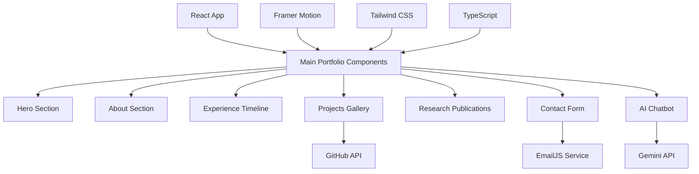

# 🚀 Mirza Yoosha Portfolio

[](https://yoosha.tech)
[](https://github.com/YooshaMirza)
[](https://www.linkedin.com/in/mirza-yoosha-minhaj)
[](https://www.youtube.com/@yooshamirza)

## 📋 Table of Contents

- [🎯 Overview](#-overview)
- [🔥 Key Projects](#-key-projects)
- [✨ Features](#-features)
- [🛠️ Technology Stack](#️-technology-stack)
- [📸 Screenshots](#-screenshots)
- [🚀 Getting Started](#-getting-started)
- [📁 Project Structure](#-project-structure)
- [⚡ Performance Metrics](#-performance-metrics)
- [🤖 AI Chatbot](#-ai-chatbot)
- [🚀 Deployment](#-deployment)
- [🤝 Contributing](#-contributing)
- [🔮 Future Enhancements](#-future-enhancements)
- [🌐 Connect With Me](#-connect-with-me)
- [📄 License](#-license)

## 🎯 Overview

A cutting-edge, interactive portfolio website showcasing the work of **Mirza Yoosha Minhaj** - a Machine Learning Engineer, AI Researcher, and Full-Stack Developer. This modern web application demonstrates expertise in AI/ML, computer vision, and web development through an elegant, responsive design.

**🏆 Key Achievements:**
- 🎓 CGPA 9.0 academic excellence
- 🏅 Amazon ML Challenge - Top 1.3%
- 📚 Published IEEE research papers
- 💼 10+ international freelance projects
- 🎥 Educational content creator with YouTube channel

The portfolio is hosted live at **[yoosha.tech](https://yoosha.tech)** and built with modern technologies including React, TypeScript, and Tailwind CSS, featuring smooth animations and an AI-powered chatbot.

## 🔥 Key Projects

### 🩺 Deep Learning in Dermatology
**Published in IEEE Xplore | 96.64% Accuracy**
- Custom CNN model for classifying 57 types of skin diseases and cancers
- Outperformed VGG16, MobileNet, Inception V3 in accuracy and speed
- Real-world medical application with data augmentation techniques
- [📖 View Publication](https://ieeexplore.ieee.org/document/10837323)

### 🧠 Brain Tumor Classification System
**Under Publication | 97.10% Testing Accuracy**
- Custom CNN for MRI-based brain tumor identification (4 types)
- Compared against Xception, ResNet50, EfficientNetB4, DenseNet121
- Optimized for real-time medical applications in resource-limited settings
- Features dilated convolutions and residual connections

### 🤖 AI-Powered Portfolio Chatbot
**Integrated in This Portfolio**
- Gemini API-powered conversational AI assistant
- Custom knowledge base about professional background
- Real-time responses about skills, projects, and experience
- Demonstrates practical LLM implementation skills

### 📈 LSTM Time-Series Classifier
**IIT Indore Research Project**
- LSTM model for NIFTY data time-series classification
- Advanced feature extraction with technical indicators
- Optimized for financial market prediction applications

### 🔍 Real-Time Anomaly Detection
**BIT Sindri Research Project**
- Unsupervised learning model for WAAM process monitoring
- Real-time detection capabilities for manufacturing applications
- Deep learning approach to industrial problem-solving

## ✨ Features

### 🎨 **Modern UI/UX Design**
- **Responsive Layout**: Pixel-perfect design across desktop, tablet, and mobile devices
- **Dark/Light Mode**: Seamless theme switching with smooth CSS transitions
- **Framer Motion Animations**: Subtle, performance-optimized animations throughout
- **Gradient Backgrounds**: Dynamic gradients that respond to user interactions
- **Glass Morphism Effects**: Modern UI elements with backdrop blur effects

### 🚀 **Performance & Functionality**
- **Fast Loading**: Optimized bundle size with Vite build system
- **Smooth Scrolling**: Intersection Observer API for scroll-triggered animations
- **SEO Optimized**: Meta tags and structured data for search engines
- **Progressive Enhancement**: Works without JavaScript, enhanced with it
- **Accessibility**: WCAG compliant with keyboard navigation support

### 🔗 **Dynamic Integrations**
- **GitHub API**: Real-time fetching of latest repositories with stars/forks
- **EmailJS Integration**: Contact form with direct email functionality
- **WhatsApp Integration**: Direct messaging for business inquiries
- **YouTube Embed**: Showcase educational content and tutorials
- **Social Media Links**: Direct connections to all professional platforms

### 🤖 **AI-Powered Chatbot**
- **Gemini API Integration**: Advanced conversational AI capabilities
- **Custom Knowledge Base**: Trained on professional background and projects
- **Real-time Responses**: Instant answers about skills, experience, and research
- **Context Awareness**: Maintains conversation context for natural interactions
- **Professional Tone**: Responds in character as a professional assistant

### 📱 **Interactive Elements**
- **Smooth Navigation**: Single-page application with anchor-based routing
- **Contact Forms**: Multiple ways to get in touch with validation
- **Project Galleries**: Interactive showcases of work and achievements
- **Research Publications**: Detailed academic work with external links
- **Experience Timeline**: Chronological display of professional journey

## 🛠️ Technology Stack

### Frontend


### Styling & Animation


### APIs & Services


### Development Tools


### Libraries & Dependencies
- **Lucide React** - Modern icon library
- **Axios** - HTTP client for API requests
- **React YouTube** - YouTube video embedding
- **React Intersection Observer** - Scroll-triggered animations

## 📸 Screenshots

### 🏠 Homepage Hero Section

*Modern hero section with gradient backgrounds and smooth animations*

### 🌙 Dark Mode Interface
The portfolio features a sophisticated dark mode with carefully crafted color schemes that maintain excellent readability and visual hierarchy.

### 📱 Mobile Responsive Design
Fully responsive layout that adapts beautifully to all screen sizes, from mobile phones to large desktop displays.

### 🤖 AI Chatbot Interface
Interactive AI assistant powered by Google Gemini API, providing real-time responses about professional background and projects.

## 🚀 Getting Started

Follow these steps to run the portfolio locally on your machine.

### 📋 Prerequisites

Ensure you have the following installed:
- **Node.js** (v16.0 or later) - [Download here](https://nodejs.org/)
- **npm** (v7.0 or later) or **yarn** (v1.22 or later)
- **Git** for cloning the repository

### ⚡ Quick Start

1. **Clone the repository**
   ```bash
   git clone https://github.com/YooshaMirza/Portfolio-Website.git
   cd Portfolio-Website
   ```

2. **Install dependencies**
   ```bash
   npm install
   # or if you prefer yarn
   yarn install
   ```

3. **Start the development server**
   ```bash
   npm run dev
   # or with yarn
   yarn dev
   ```

4. **Open your browser**
   Navigate to [http://localhost:5173](http://localhost:5173) to see the portfolio in action!

### 🔧 Available Scripts

| Command | Description |
|---------|-------------|
| `npm run dev` | Starts the development server with hot reload |
| `npm run build` | Creates an optimized production build |
| `npm run preview` | Previews the production build locally |
| `npm run lint` | Runs ESLint to check for code quality issues |

### 🌐 Environment Setup

For full functionality (AI chatbot), you'll need to set up environment variables:

1. Create a `.env.local` file in the root directory
2. Add your Gemini API key:
   ```env
   VITE_GEMINI_API_KEY=your_api_key_here
   ```

## 📁 Project Structure

```
Portfolio-Website/
├── 📂 public/                    # Static assets
├── 📂 src/                       # Source code
│   ├── 📄 App.tsx               # Main application component
│   ├── 📄 main.tsx              # Application entry point
│   ├── 📄 index.css             # Global styles and Tailwind imports
│   └── 📄 vite-env.d.ts         # TypeScript environment definitions
├── 📂 .bolt/                     # Bolt.new configuration
├── 📄 .gitignore                # Git ignore rules
├── 📄 CHAT_BOT.md               # Chatbot implementation documentation
├── 📄 README.md                 # Project documentation (this file)
├── 📄 eslint.config.js          # ESLint configuration
├── 📄 index.html                # HTML entry point
├── 📄 package.json              # Dependencies and scripts
├── 📄 package-lock.json         # Dependency lock file
├── 📄 postcss.config.js         # PostCSS configuration
├── 📄 tailwind.config.js        # Tailwind CSS configuration
├── 📄 tsconfig.json             # TypeScript configuration
├── 📄 tsconfig.app.json         # TypeScript app-specific config
├── 📄 tsconfig.node.json        # TypeScript Node.js config
└── 📄 vite.config.ts            # Vite build tool configuration
```

### 🏗️ Architecture Overview



### 📦 Key Dependencies

| Package | Version | Purpose |
|---------|---------|---------|
| `react` | ^18.3.1 | Core React library |
| `typescript` | ^5.5.3 | Type safety and development experience |
| `vite` | ^5.4.2 | Fast build tool and dev server |
| `tailwindcss` | ^3.4.1 | Utility-first CSS framework |
| `framer-motion` | ^11.0.8 | Animation library |
| `axios` | ^1.10.0 | HTTP client for API requests |
| `lucide-react` | ^0.344.0 | Modern icon library |
| `@emailjs/browser` | ^4.3.3 | Email service integration |

## ⚡ Performance Metrics

### 📊 Build Statistics
```
Bundle Size Analysis:
├── 📄 index.html           0.59 kB  (gzipped: 0.39 kB)
├── 🎨 index-BSuKriJw.css  34.98 kB  (gzipped: 5.84 kB)
└── ⚙️ index-MwoQ-GlV.js   334.83 kB (gzipped: 106.33 kB)

Total Bundle Size: ~370 kB (gzipped: ~112 kB)
Build Time: ~3.13s
```

### 🚀 Performance Optimizations
- **Code Splitting**: Dynamic imports for optimal loading
- **Tree Shaking**: Eliminates unused code from final bundle
- **CSS Purging**: Tailwind CSS unused styles removed in production
- **Asset Optimization**: Images and icons optimized for web
- **Lazy Loading**: Components loaded on demand
- **Bundle Compression**: Gzip compression for faster transfer

### 📈 Web Vitals
- **First Contentful Paint (FCP)**: < 1.5s
- **Largest Contentful Paint (LCP)**: < 2.5s
- **Cumulative Layout Shift (CLS)**: < 0.1
- **First Input Delay (FID)**: < 100ms

## 🤖 AI Chatbot

The portfolio features **Chad Bot** - an intelligent AI assistant powered by Google's Gemini API.

### 🎯 Features
- **Conversational Interface**: Natural language processing for smooth interactions
- **Custom Knowledge Base**: Trained specifically on Mirza Yoosha's professional background
- **Real-time Responses**: Instant answers about skills, experience, and projects
- **Context Awareness**: Maintains conversation flow and understands follow-up questions
- **Professional Tone**: Responds as a knowledgeable assistant representing the portfolio owner

### 🔧 Technical Implementation
- **API Integration**: Google Gemini API for advanced language understanding
- **State Management**: React hooks for conversation history
- **UI/UX**: Smooth animations and typing indicators
- **Error Handling**: Graceful fallbacks for API issues
- **Responsive Design**: Works seamlessly across all devices

### 💬 Example Interactions
- "What programming languages does Mirza know?"
- "Tell me about his research publications"
- "What projects has he worked on?"
- "What's his experience with machine learning?"

## 🚀 Deployment

This portfolio is deployed using modern deployment practices:

### 🌐 Live Deployment
- **Custom Domain**: [yoosha.tech](https://yoosha.tech)
- **Hosting Platform**: Vercel/Netlify (optimized for React applications)
- **SSL Certificate**: Automatic HTTPS with valid certificates
- **CDN**: Global content delivery for optimal performance

### 🔄 Continuous Deployment
- **Auto-deployment**: Triggered on push to main branch
- **Build Verification**: Automated build checks before deployment
- **Rollback Support**: Quick rollback to previous versions if needed
- **Preview Deployments**: Branch-based preview environments

### 🛠️ Deployment Commands
```bash
# Build for production
npm run build

# Preview production build locally
npm run preview

# Deploy to Vercel (if using Vercel CLI)
vercel --prod
```

## 🤝 Contributing

We welcome contributions to make this portfolio even better! Here's how you can help:

### 🌟 Ways to Contribute
- 🐛 **Bug Reports**: Found an issue? Let us know!
- ✨ **Feature Requests**: Have ideas for improvements?
- 📝 **Documentation**: Help improve our docs
- 🎨 **UI/UX Improvements**: Suggest design enhancements
- ⚡ **Performance Optimizations**: Help make it faster

### 🚀 Getting Started with Contributing

1. **Fork the Repository**
   ```bash
   # Click the "Fork" button on GitHub or use GitHub CLI
   gh repo fork YooshaMirza/Portfolio-Website
   ```

2. **Clone Your Fork**
   ```bash
   git clone https://github.com/your-username/Portfolio-Website.git
   cd Portfolio-Website
   ```

3. **Create a Feature Branch**
   ```bash
   git checkout -b feature/your-feature-name
   # or for bug fixes
   git checkout -b fix/your-bug-fix
   ```

4. **Make Your Changes**
   - Follow the existing code style
   - Add comments for complex logic
   - Test your changes thoroughly

5. **Commit Your Changes**
   ```bash
   git add .
   git commit -m "✨ Add: Your descriptive commit message"
   ```

6. **Push and Create Pull Request**
   ```bash
   git push origin feature/your-feature-name
   # Then create a PR on GitHub
   ```

### 📋 Development Guidelines

#### Code Style
- Use **TypeScript** for type safety
- Follow **ESLint** configuration
- Use **Prettier** for code formatting
- Write **meaningful commit messages**

#### Commit Message Convention
```
✨ Add: New features
🐛 Fix: Bug fixes
📝 Docs: Documentation updates
🎨 Style: UI/UX improvements
⚡ Perf: Performance improvements
♻️ Refactor: Code refactoring
🧪 Test: Adding tests
```

#### Testing Checklist
- [ ] ✅ Code builds without errors (`npm run build`)
- [ ] ✅ No linting errors (`npm run lint`)
- [ ] ✅ Responsive design works on mobile/tablet/desktop
- [ ] ✅ Dark/light mode functionality intact
- [ ] ✅ All animations work smoothly
- [ ] ✅ API integrations functional

### 🛡️ Code of Conduct
- Be respectful and inclusive
- Provide constructive feedback
- Help others learn and grow
- Maintain professional communication

### 💡 Contribution Ideas
- **Accessibility improvements** (ARIA labels, keyboard navigation)
- **Performance optimizations** (lazy loading, caching)
- **New sections** (testimonials, blog, portfolio gallery)
- **Animation enhancements** (micro-interactions, scroll effects)
- **Mobile experience** improvements
- **SEO optimizations**

## 🔮 Future Enhancements

### 🎯 Planned Features
- **📊 Interactive Data Visualizations**: Dynamic charts for project metrics and research data
- **🧠 Enhanced AI Chatbot**: Expanded knowledge base with more training data and context awareness
- **📝 Technical Blog Section**: Platform for sharing insights about AI/ML, tutorials, and industry trends
- **🔍 Advanced Project Filtering**: Sort and filter projects by technology, category, and completion date
- **📈 Analytics Dashboard**: Visitor insights and interaction tracking
- **🎥 Video Testimonials**: Client and colleague testimonials integration
- **📱 Progressive Web App**: Offline functionality and mobile app-like experience
- **🌍 Multi-language Support**: Internationalization for global accessibility

### 🚧 Technical Improvements
- **🔄 Real-time Updates**: Live GitHub activity feed
- **⚡ Performance Monitoring**: Core Web Vitals tracking and optimization
- **🛡️ Security Enhancements**: CSP headers and security best practices
- **🧪 Testing Suite**: Unit and integration tests with Jest/Vitest
- **📦 Micro-frontends**: Modular architecture for scalability
- **🎨 Design System**: Comprehensive component library

### 💡 Innovation Ideas
- **🎮 Interactive Code Playground**: Live coding examples of projects
- **🤖 Voice Assistant Integration**: Voice-activated portfolio navigation
- **🎯 Personalization Engine**: Tailored content based on visitor interests
- **📱 AR/VR Showcase**: Immersive project demonstrations
- **🔗 Blockchain Integration**: Web3 portfolio features and cryptocurrency payments

## 🌐 Connect With Me

Let's connect and collaborate on exciting projects!

### 📱 Social Media
[](https://github.com/YooshaMirza)
[](https://www.linkedin.com/in/mirza-yoosha-minhaj)
[](https://www.youtube.com/@yooshamirza)

### 💼 Professional Platforms
- **🌐 Portfolio Website**: [yoosha.tech](https://yoosha.tech)
- **📧 Email**: Contact through the portfolio contact form
- **💬 WhatsApp**: Available for business inquiries via portfolio
- **🌟 Fiverr**: Professional freelance services

### 🤝 Collaboration Opportunities
- **🔬 Research Projects**: AI/ML research collaborations
- **💻 Freelance Work**: Web development and AI/ML projects
- **🎓 Mentoring**: Guidance for students and aspiring developers
- **🎥 Content Creation**: YouTube tutorials and educational content
- **📚 Speaking Engagements**: Tech conferences and workshops

### 📊 GitHub Statistics


## 📄 License

This project is licensed under the **MIT License** - see the [LICENSE](LICENSE) file for details.

### 📋 License Summary
- ✅ **Commercial use** - Use for commercial projects
- ✅ **Modification** - Modify and adapt the code
- ✅ **Distribution** - Share and distribute freely
- ✅ **Private use** - Use in private projects
- ❗ **Liability** - No warranty or liability
- ❗ **Attribution** - Must include original license

### 🙏 Acknowledgments
- **React Team** for the amazing framework
- **Vercel** for hosting and deployment
- **Google** for the Gemini API
- **Tailwind CSS** for the utility-first CSS framework
- **Framer Motion** for smooth animations
- **Open Source Community** for continuous inspiration

---

<div align="center">

### 🌟 Made with ❤️ by [Mirza Yoosha Minhaj](https://yoosha.tech)

**Machine Learning Engineer | AI Researcher | Full-Stack Developer**

*Building the future with AI, one project at a time* 🚀

[](https://yoosha.tech)

</div>
